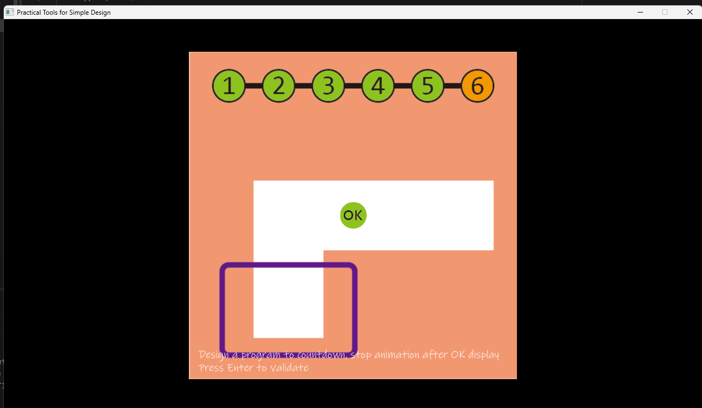

# Abstract

冰火姊弟

組員：

- 111590050 張家榮
- 111590054 謝永宏

# Game Introduction

玩家控制兩個角色，各自擁有不同特性(冰&火)，基本上的邏輯是不能碰到相異顏色的水(熔岩&水)，目標是雙方都進到對應顏色的門，分數是以通關時間計算。
進階目標是要拿到對應的寶石以獲得更高的得分。
目標是做五個關卡。

介紹影片1：https://youtu.be/Qc-VOLcYCzw?si=9Oc-rsVUP_RmMRjy
介紹影片2：https://www.youtube.com/watch?v=XUm0B-yiqwU

# Development timeline

- Week 02：練習&課程介紹
  -用長頸鹿大冒險熟悉框架
- Week 03：製作proposal
  -製作proposal
  -尋找美術素材
- Week 04：遊戲基礎邏輯
  -處理遊戲階段,ex:暫停、結算、死亡...
- Week 05：遊戲基礎邏輯
  -處理角色移動
  -處理物件移動
- Week 06：遊戲基礎邏輯
  -處理物件互動邏輯,ex:寶石、陷阱...
- Week 07：遊戲基礎邏輯
  -處理物件互動邏輯,ex:終點、開關...
- Week 08：遊戲基礎邏輯
  -確認遊戲基礎功能正常
- Week 09：遊戲進階邏輯
  -處理物件互動邏輯,ex:重量
- Week 10：遊戲進階邏輯
  -處理物件互動邏輯,ex:加速度、旋轉...
- Week 11：遊戲進階邏輯
  -處理物件互動邏輯
- Week 12：遊戲進階邏輯
  -關卡設計
- Week 13：遊戲進階邏輯
  -製作動畫
- Week 14：遊戲最終階段
  -測試&debug
- Week 15：遊戲最終階段
  -測試&設計關卡分數
- Week 16：遊戲最終階段
  -測試&製作高分紀錄

- Week 17：提交
  -製作遊戲簡報
  -驗收並提交 

完善程式碼