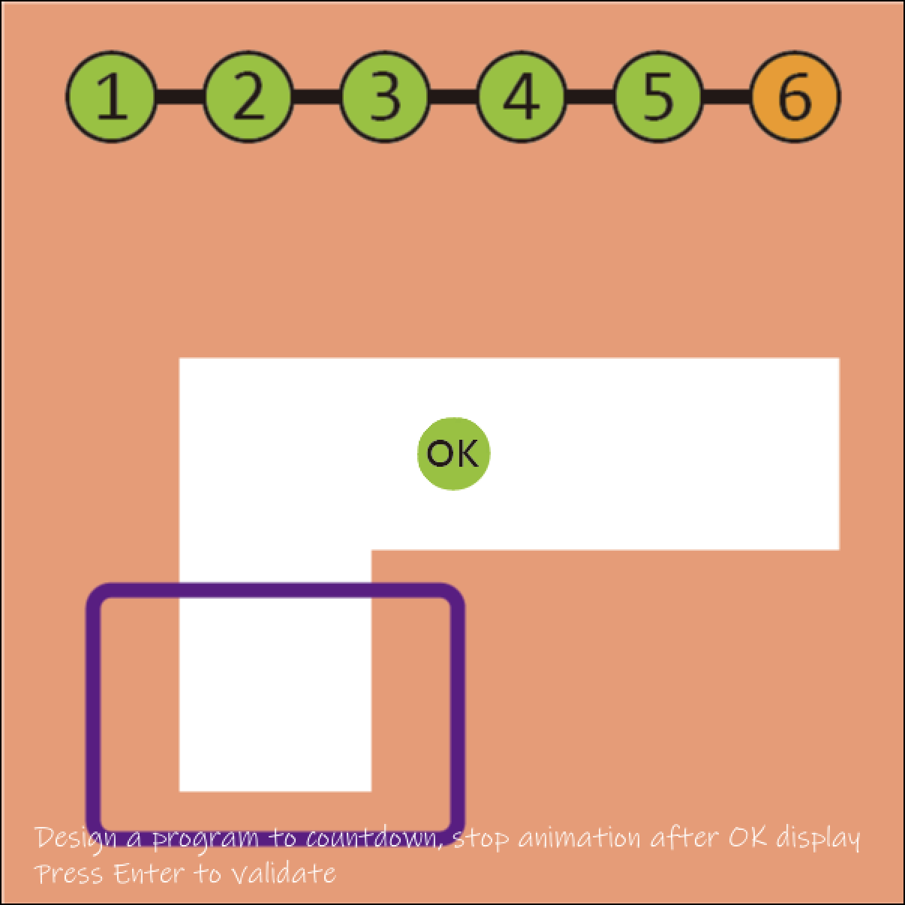
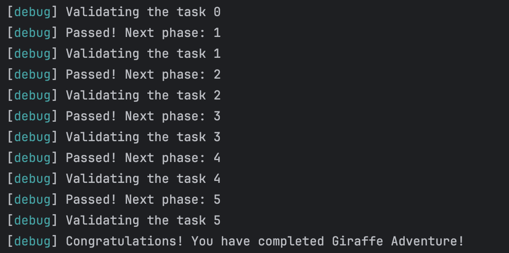
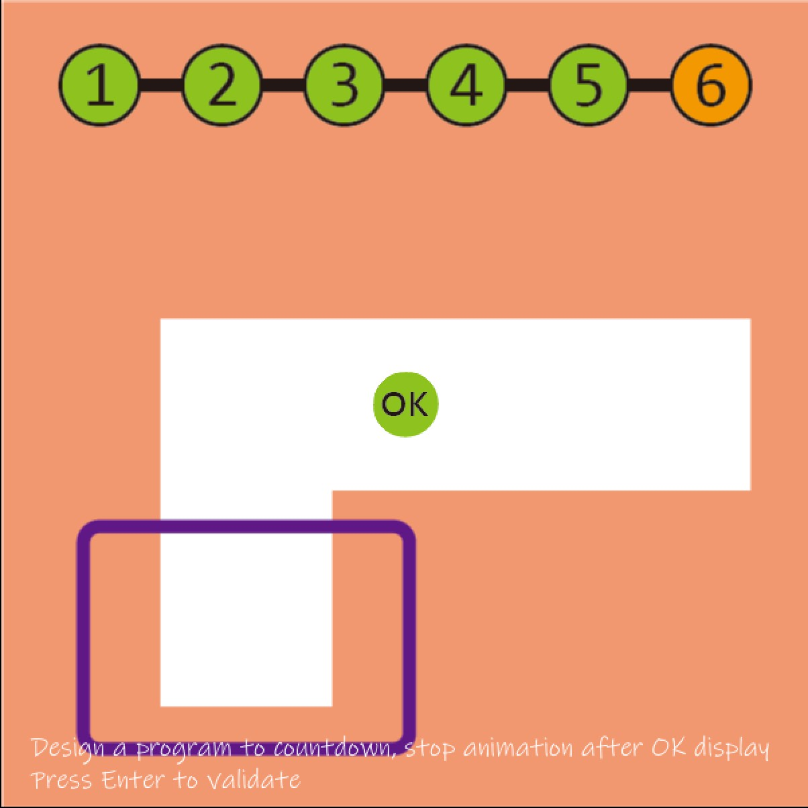
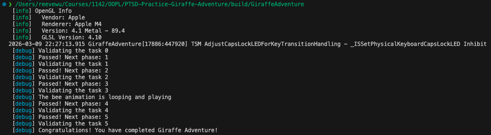

# Abstract

遊戲名稱：植物大戰殭屍

組員：

- 112590454 林妍蓁
- 112590455 吳哲丞

# Game Introduction

**《植物大戰殭屍》（Plants vs. Zombies）**是一款 2D 橫向策略塔防遊戲（Tower Defense）。玩家需要在自家花園的不同地圖上種植各種植物，阻止殭屍從右側入侵並進入房子。

在遊戲中，玩家透過收集 陽光作為資源，種植不同功能的植物，例如攻擊型、防禦型或輔助型植物。每種植物都有不同的能力與特性。

隨著關卡推進，殭屍的種類會逐漸增加，例如速度較快或防禦力較高的殭屍，玩家必須根據不同殭屍的特性搭配合適的植物與佈局策略，才能有效防禦並通過關卡。

[遊戲連結](https://www.youtube.com/watch?v=XENla8M3910)

# Development timeline

- Week 02：撰寫 Proposal、蒐集素材
  - [ ] 撰寫專題 Proposal
  - [ ] 蒐集植物、殭屍與背景素材

- Week 03：素材整理與畫面設計
  - [ ] 整理遊戲角色與 UI 素材
  - [ ] 設計遊戲開始畫面與基本 UI

- Week 04：遊戲架構設計
  - [ ] 設計植物與殭屍的基本類別
  - [ ] 規劃地圖與格子系統

- Week 05：地圖與場景系統
  - [ ] 建立遊戲地圖與背景
  - [ ] 設計植物可放置的位置

- Week 06：植物系統
  - [ ] 建立植物物件與基本屬性
  - [ ] 實作植物種植機制

- Week 07：殭屍系統
  - [ ] 建立殭屍物件與基本屬性
  - [ ] 實作殭屍生成與移動

- Week 08：期中 Demo
  - [ ] 完成基本植物與殭屍互動
  - [ ] 展示基本遊戲流程

- Week 09：期中 Demo
  - [ ] 修正期中 Demo 問題
  - [ ] 優化遊戲操作流程

- Week 10：攻擊與碰撞機制
  - [ ] 實作植物攻擊（子彈系統）
  - [ ] 建立碰撞判定

- Week 11：戰鬥系統
  - [ ] 實作殭屍與植物的互動
  - [ ] 設計角色生命與死亡機制

- Week 12：資源系統
  - [ ] 建立陽光產生機制
  - [ ] 設計陽光消耗與植物購買

- Week 13：遊戲關卡
  - [ ] 設計基本關卡
  - [ ] 設定殭屍生成與通關條件

- Week 14：遊戲機制優化
  - [ ] 加入鏟子或輔助道具
  - [ ] 調整遊戲平衡

- Week 15：UI 與音效
  - [ ] 優化遊戲 UI
  - [ ] 加入基本音效

- Week 16：測試與除錯
  - [ ] 修復 Bug
  - [ ] 進行遊戲測試

- Week 17：提交
  - [ ] 拍攝展示影片
  - [ ] 製作遊戲簡報
  - [ ] 提交最終專題

# PTSD Girafee Adventure 通關證明

### 112590454 林妍蓁

**遊戲畫面**

**終端機輸出**

### 112590455 吳哲丞

**遊戲畫面**

**終端機輸出**

