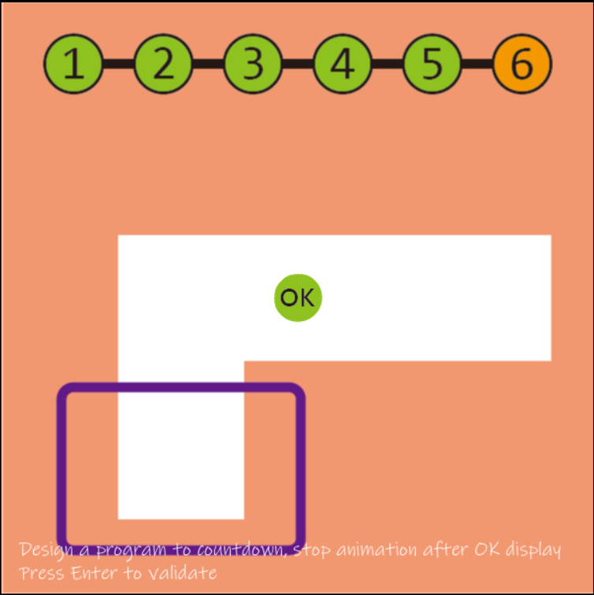

# Abstract

遊戲名稱：坦克大戰

組員：

- 113590022 張育慎

# Game Introduction

本遊戲參考任天堂經典遊戲《坦克大戰 (Battle City)》進行設計。玩家操控坦克在地圖中移動與射擊，消滅場上的敵方坦克。遊戲設計多個關卡，不同關卡會有不同的地形與敵人數量，使難度逐漸提高。玩家被敵方坦克擊中時會失去一條生命，當生命數耗盡時遊戲失敗；若成功擊敗關卡中的所有敵人即可過關。當玩家完成最終關卡後，遊戲將出現結局畫面，代表玩家成功通過所有挑戰並取得勝利。 
[遊戲介紹連結](https://youtu.be/umUYIGgivg4?si=zAAGK-ZKhneJmXKZ)

# Development timeline

- Week 2：準備素材
  -  [ ] 蒐集遊戲素材（坦克、子彈、地圖、爆炸效果）
  -  [ ] 蒐集音效或背景音樂

- Week 3：處理遊戲封面
  -  [ ]遊戲封面圖片
  -  [ ]設計開始畫面（Start Menu）

- Week 4：遊戲架構設計
  -  [ ] 規劃主要類別（Player、Enemy、Bullet、Map）
  -  [ ] 建立遊戲基本框架
  -  [ ] 初始化遊戲視窗與主迴圈

- Week 5：玩家坦克設計
  -  [ ] 建立玩家坦克
  -  [ ] 實作玩家移動控制
  -  [ ] 玩家坦克顯示與動畫
  -  [ ] 玩家發射子彈
  -  [ ] 子彈移動、效果與消失機制

- Week 6：敵方坦克
  -  [ ] 建立敵方坦克類別
  -  [ ] 敵人基本移動
  -  [ ] 敵人自動射擊

- Week 7：碰撞偵測
  -  [ ] 子彈與坦克碰撞
  -  [ ] 坦克與牆壁碰撞
  -  [ ] 簡單爆炸效果

- Week 8：生命與死亡機制
  -  [ ] 玩家生命系統
  -  [ ] 玩家死亡判定
  -  [ ] Game Over 畫面

- Week 9：地圖系統
  -  [ ] 設計地圖結構
  -  [ ] 加入障礙物
  -  [ ] 地圖載入功能

- Week 10：關卡系統
  -  [ ] 建立關卡資料
  -  [ ] 關卡切換
  -  [ ] 敵人數量設定

- Week 11：敵人 AI 強化
  -  [ ] 隨機行為
  -  [ ] 提升遊戲挑戰性

- Week 12：UI 介面
  -  [ ] 顯示生命數
  -  [ ] 顯示分數
  -  [ ] 顯示關卡資訊

- Week 13：音效與動畫
  -  [ ] 射擊音效
  -  [ ] 爆炸效果
  -  [ ] UI 動畫

- Week 14：遊戲勝利條件
  -  [ ] 消滅所有敵人過關
  -  [ ] 最終關卡設計
  -  [ ] 結局畫面

- Week 15：遊戲優化
  -  [ ] 修正 bug
  -  [ ] 改善操作手感
  -  [ ] 效能優化

- Week 16：遊戲測試
  -  [ ] 測試所有關卡
  -  [ ] 調整難度
  -  [ ] 修正問題

- Week 17：完成版本
  -  [ ] 完成完整遊戲流程
  -  [ ] 製作遊戲說明文件
  -  [ ] 整理專案

# 長頸鹿大冒險通關證明

