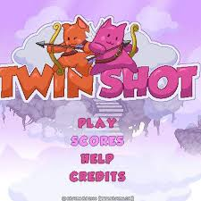
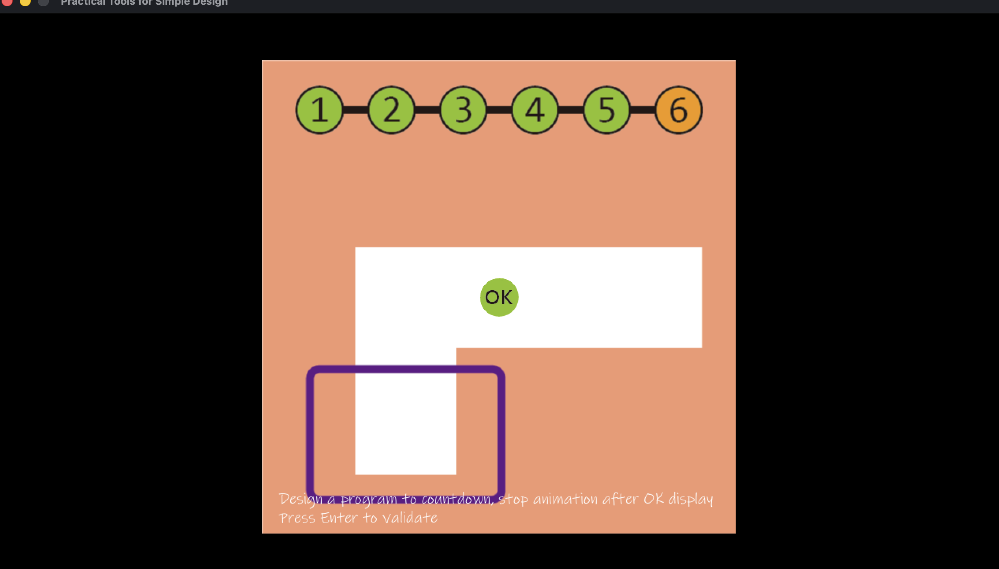

# Abstract

遊戲名稱：Twin Shot

組員：

- 113590025 吳梓暟
- 113590050 孫盈盈

# Game Introduction

《Twin Shot》是一款遊戲機台射擊遊戲，玩家要使用弓箭來抵禦入侵者，保衛家園。大概會做三關。希望能做完。
影面參考: https://www.youtube.com/watch?v=HlvRMhk2_CE

# Development timeline

- Week 2：撰寫 Proposal、完成Giraffe Adventure
  - [ ] 撰寫 Proposal
  - [ ] 完成 Giraffe Adventure
- Week 3：找素材
  - [ ] 遊戲角色的素材(那隻貓、還有敵人)
  - [ ] 場景素材
- Week 4：設計場景
  - [ ] 把地圖做出來
- Week 5：讓角色動起來
  - [ ] 可以用上下左右移動
  - [ ] 上是跳，讓角色可以站在設計的場景上
- Week 6：讓角色動起來
  - [ ] 同 Week 5
- Week 7：調整角色
  - [ ] 主要跳的重力更改
- Week 8：調整角色
  - [ ] 同 Week 7
- Week 9：敵人設計、角色攻擊
  - [ ] 做出一個普通地面史萊姆
  - [ ] 攻擊一次敵人，敵人要被擊倒
- Week 10：繼續製作角色攻擊
  - [ ] 同 Week 9
- Week 11：敵人設計、角色攻擊
  - [ ] 做出一個小飛象
  - [ ] 攻擊一次敵人，敵人要被擊倒
- Week 12：Boss設計、角色攻擊
  - [ ] 做出一個Boss
  - [ ] 攻擊多次敵人，敵人要被擊倒
- Week 13：關卡設計
  - [ ] 前面結合，做出第一個關卡
- Week 14：關卡設計
  - [ ] 前面結合，做出第二個關卡
- Week 15：關卡設計
  - [ ] 前面結合，做出第三個關卡
- Week 16：動畫及優化
  - [ ] 讓角色或敵人有一些動畫，讓畫面靈動一點
  - [ ] 對程式碼做優化
- Week 17：提交
  - [ ] 拍攝影片
  - [ ] 做一份報告
  - [ ] 驗收提交
# 長頸鹿大冒險

